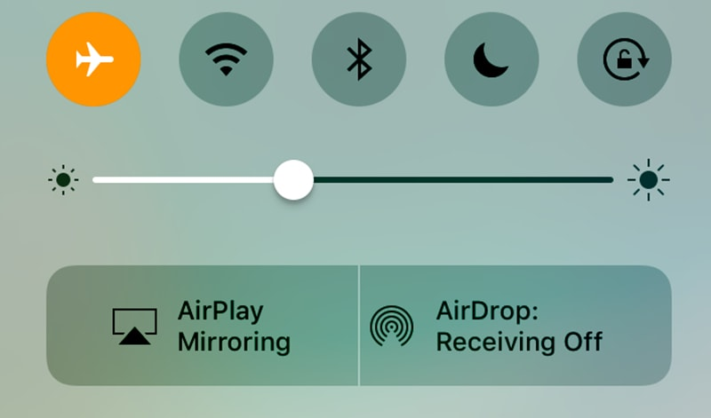

 
No, this is not a post about *offline first* development, which has been mentioned a lot by [Realm](https://realm.io/solutions/offline-first/) and [Google] (https://developer.chrome.com/apps/offline_apps) lately. Even Gatsby, the static page generator I'm using for this page, has a [plugin for offline support] (https://www.gatsbyjs.org/packages/gatsby-plugin-offline/). No, this is a post about *coding offline*.  
 
When I got home from work today, I sat down in my sofa and turned on my Apple TV. Zapping through the various streaming apps I was greeted with infinite loading indicators. Hurray! I tried the classic *"reset the router/modem"* trick. Did not work. So I checked my ISP's homepage and got to see an alert telling me that my network would be down for three hours.
 
Three hours disconnected. Three hours. I was looking forward to continue tinkering on this webpage but without internet I felt lost and confused. How do I do this, change that? I realized how connected we are when develop things and easily fallback on *finding* the solution online rather than *figuring* it out ourselves. I realized how much more fun it is to actually figure something out yourself rather than looking for people with the same problems and get inspired by their solutions.  
 
I challenged myself to do my homepage tinkering without any online support. It actually worked out really well and I felt like I was creating something coming out of my own creative mind rather than using someone else's idea or approach. Sure, it might not have been the most challenging problem (editing the header), but it was something my own brain took charge of, which felt great.  
 

I remember having that same feeling two years ago. It was during a flight back to Stockholm from Tokyo. At that time I was working on a new app for [Vasaloppet](http://www.vasaloppet.se/), which is the world’s oldest, biggest and longest ski race. The event was approaching fast, and so was the application's deadline, which meant time was of the essence. So, stressed me brought up the laptop somewhere high above China and started coding. No internet. No nothing. Just me versus the code. It was amazing. No distractions, nothing else to think about but the code. My mind was given so much space to figure things out on its own without any outside influence. It was great! When I landed I had finished writing a big module I had been reluctant for weeks to write. It turned out really good and that's the story of how I created the race monitoring logic for Vasaloppet's app on a plane. 
 
It seems like I'm not the only that has experienced this kind of flow of inspiration. One of the creators of [Spots](https://github.com/hyperoslo/Spots) has written a [Medium post] (https://medium.com/@zenangst/hitting-the-sweet-spot-of-inspiration-637d387bc629) about a similar experience of how he started writing the Spots library inside a plane. So, I guess sometimes it's good to be disconnected and let your mind have time to figure things out on its own! Happy coding!
 