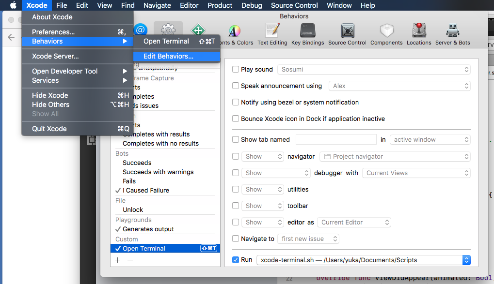

Once in a while you stumble upon something that makes your everyday work more pleasant and smooth. A few weeks ago I had one such moment when I found this neat little [Medium post](https://medium.com/rosberryapps/lets-optimize-the-work-with-terminal-for-xcode-developers-194623da55d4) by Nikita Ermolenko.

As a developer you're bound to be using the terminal quite a bit and for iOS development this often involves running git commands, fastlane commands and commands for dependency managers such as carthage or cocoapods. Usually these commands are run from the project's root folder, but there is no quick way from within Xcode to run these commands. Nikita's post describes a very pleasant way of opening up a terminal at desired path from Xcode. In this post I'll describe these steps so that you also can start using this!

**Step 1:** Create a script with the following content. Name it as you like and save it somewhere good (we'll refer to this script file later).
```bash
#!/bin/sh

if [ -n "$XcodeProjectPath" ]; then	
  open -a Terminal "$XcodeProjectPath"/..
else		
  open -a Terminal "$XcodeWorkspacePath"/..
fi
```

**Step 2:** Open a terminal and navigate to where you saved your script file. Run the command **`chmod +x <your_script.sh>`** to make the script executable.

**Step 3:** Create a custom Xcode behavior. You do this from within Xcode. Open Xcode and navigate to *Xcode menu > Behaviors > Edit Behaviors*. At the bottom there is a **`+`** button. Click that button and create a new behavior. Chose a name for it, create a short cut (I chose *cmd+shift+t*) and in the **`run`** field select the script you created earlier.



**Step 4:** Try out your new shortcut from within Xcode and enjoy easy access to the terminal from within Xcode!

I'm using this command almost everyday since I got to know about it and I'd like to thank [Nikita Ermolenko](https://medium.com/@otbivnoe) for sharing this!