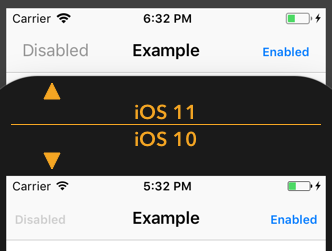

I recently noticed that the bar buttons in one of my apps looked strange. The disabled state appearance of the bar button had changed since updating to iOS11. Apparently something was changed in the UIAppearance proxying since the last update. In previous versions the following code would globally change the font of UIBarButtons for the normal state, and it would apply this to all other states as well if not already explicitly styled.

```swift
UIBarButtonItem.appearance().setTitleTextAttributes([NSAttributedStringKey.font: UIFont.boldSystemFont(ofSize: 12)], for: .normal)
```

This was changed in iOS11 and would result in bar buttons looking like the image below. 



I ended up styling UIBarButtons in the following way instead. Making sure to cover all the sensible states.

```swift
for state: UIControlState in [.normal, .disabled, .highlighted, .selected] {
  UIBarButtonItem.appearance().setTitleTextAttributes([NSAttributedStringKey.font: UIFont.boldSystemFont(ofSize: 12)], for: state)
}
```

Arguably the iOS11 behaviour is more correct, since there's nothing implying that changing the normal state appearance of a bar button should affect the other states, even though the previous behaviour was quite convenient in my opinion. Not many developers have noticed this iOS11 change and you are able to spot many apps on the market today that haven't recognized it. I have for instance noticed that the highlight state of the bar buttons in the Slack application suffer from this change.

So, if you are using UIAppearance to style your UIBarButtons (and perhaps other elements too), make sure to check that they look good in all states!