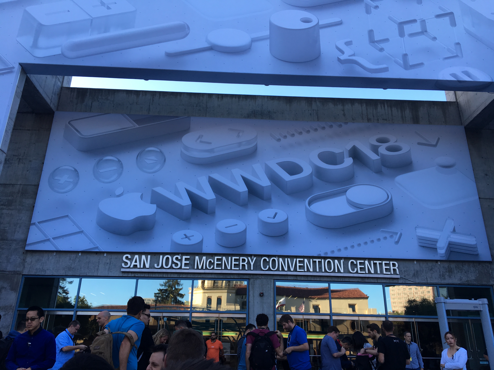

Second day done. Jet lag gone. Here are my reflections for the day

### Swift and Xcode
With Xcode10 we get Swift 4.2 and with it Apple promises a few improvements. Build times should be much faster with Xcode10. *Whole Module* compilation should no longer be needed for faster debug compilation, *Incremental* should be as fast or faster now. A new flag, *-Osize*, has been added to optimize for app size. According to the presentation this typically leads to 10-30% smaller size while making the app about 5% slower. This could be useful for countries with limited bandwith. In iOS12 the Swift runtime comes included, which should lead to further reduced app size.

Other small improvements to Swift 4.2 includes synthesization of *Hashable* and *Equatable*, better RNG functions, improved compile flag syntax and functionality.

### Cocoa
Under the hood several autolayout cases should be faster with iOS12. Nested and dependant siblings views did not scale very well in iOS11, but should be resolved in iOS12. The pre-fetch APIs used for cells should also be working better in iOS12, and is encouraged to be used. The CPU should be ramping up faster for when it is needed which should result in snappier UI. 

Grouped notifications are new to iOS12 and it should be possible now to also add own merging logic for notications, pehaps bundle several notifications from the same conversation into one.

### AR
I am still quite impressed with what Apple has done with ARKit2. Some take aways from today: 

You can save a world and load it again later. There are two ways to track images, one is based on the world and requires a certain world representation and the other is world independant. Object detection seem to be working really well. There is an example app that Apple has uploaded that can be used to scan objects. The scanned objects are stored as as *ARReferenceObject* and can be imported to your other AR projects. Absolutely an amazing application for museums. 

AR face tracking now has gaze tracking, meaning that you can see what direction the face is looking at. The tounge property seem to just be a boolean value stating if the tounge is in or out, so no directions from what I heard today.

### Create ML
Really easy and powerful way to apply transfer learning on existing models. Can be modified to be run as scripts, which can be very useful when you want to re-train the models. The only negative things is that, from what I know, CoreML models will only be applicable on iOS devices, so they wont be runnable on other platforms. 

### Lastly, Playgrounds!
Playgrounds should be more performant and reliable with Xcode10. Step by step execution is available and should make it easier to reason about new code. Playgrounds can be inserted into projects or workspaces and should in theory be able to serve as a great API guide for your libraries/projects. Just remember to "build before running" (direct quote from the presenter). There are new markdown comment syntax available, and it's possible to write custom playgrounds descriptions which don't necessarily have to be text, but could be an image instead. If we'll see more libraries include these kind of playgrounds guides remains to be seen, but the presenters really hopes that this will be more adapted. I see potential in it, but from previous experience it hasn't worked that well. Time will tell if Xcode10 solves this.

Tomorrow I'll try and write more about one of the big things announced this year, Siri Shortcuts!