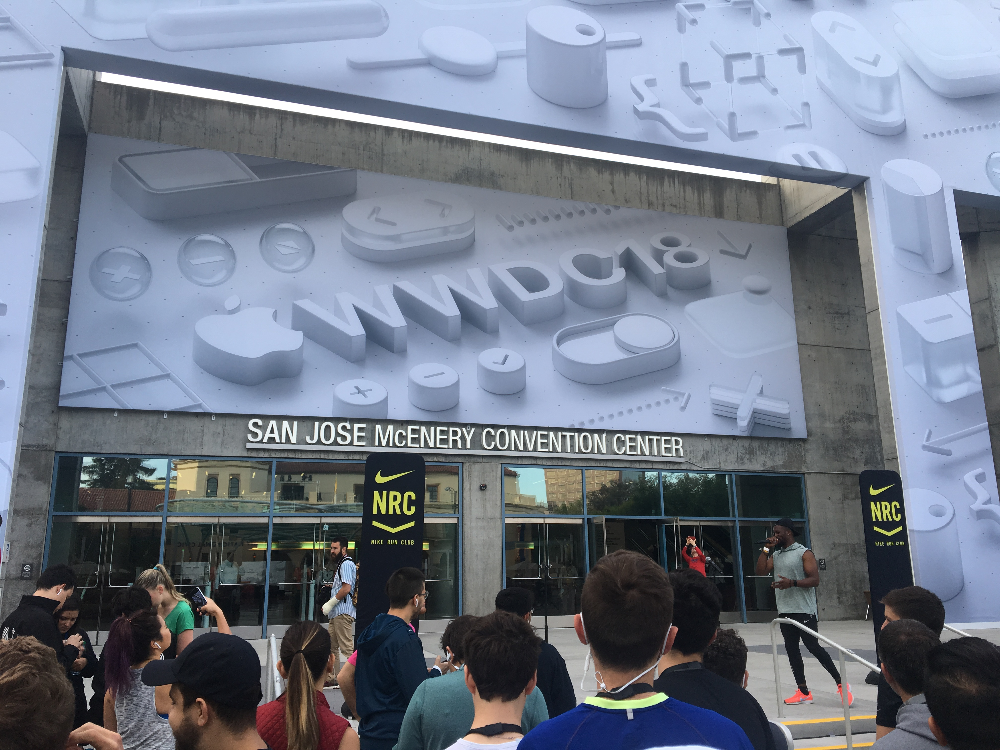

Third day of WWDC comes to an end. This day started with a run around the area together with Nike Run Club. My feet and legs had recovered fine since Stockholm Marathon and it felt great to run in the morning together with fellow developers. After the run I spent some time in the labs discussing autolayout and interface builder with an Apple engineer. The rest of the day I attended different sessions about Swift, performance and design. Below are today's reflections. I will not cover Siri Shortcuts as I promised yesterday, that will be done in a future post.

### Autolayout and IB
As I previously mentioned I had the chance to sit down and talk with an Apple engineer regarding Autolayout and Interface Builder. 

As you may know iOS12 is much more efficient at rendering complex layouts compared to iOS11. The team at Apple have looked at typical use cases of how we create UIs and noticed patterns which have been improved. Making an interface using a xib or storyboard file versus doing it programmatically should have the same performance and both are affected by the iOS12 boosts. 

One things mentioned was that if you create autolayouts using Interface Builder you're less likely to make mistakes that potentially could slow down your layouts. Overriding the updateConstraints method should be done carefully and only when really needed.

Stackviews compared to similar UIs built using constraints should be equally performant, so use the most suitable method. Using greater than or equal constraints versus equals have no major effect on the layout performance. 

The use of autoresizing views is not better or worse than autolayout performance wise. However, autolayout is the recommended way to layout out things, so if you're not already using autolayout it is about time to do so!

There are no known plans for abandoning xib files in favor for storyboards. However the engineer I talked to tend to recommend using storyboards for most cases.

### Notifications
With iOS12 a few things are happening to notifications. The most significant is the grouping of notifications. The user will however be able to toggle to use the iOS11 behavior of no grouping. Notification UI extensions are now much more dynamic, and it's possible to have interactable elements within these, for instance you could have a favorite icon inside the view that the user can press and carry out an action. Push notification actions are also more dynamic, and can be adjusted on events, for example you could have a push action for "like" and when you press this button your "like" button changes to an "unlike" button.

Grouping of notifications can be done automatically by the app, or you can specify your own thread id. This would create new groups for each thread. 

There is a new type of requesting push permissions from the user which they call "provisional authorization". If we request this the user will not be prompted with the push permission message within the app. Instead the user will be getting pushes automatically on a "trial period", and the push messages will be in quiet mode. When a user receives a push from an app with provisional authorization the user will see an option to keep getting pushes from the app, or block it.

There will be more settings for the user to handle pushes, and this will be available from more places. There is a new API call that the apps can make use of to link the user into an in-app notification settings view, where the user can have granular control over what types of notification he/she wants to receive.

That's it for today, I'll write more tomorrow!